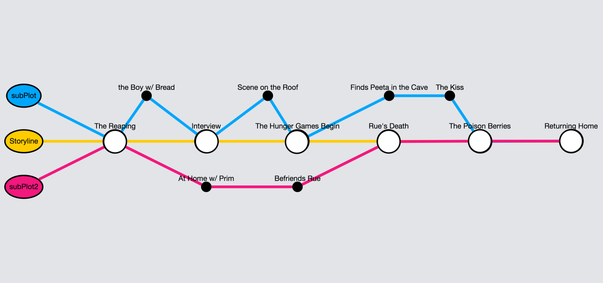

## Cytoscape Practice

I wanted to play around with the Cytoscape.js library in order to build an easy to read visualization of a story's plot.
The API is easy to use because it takes JSON to create all visualizations (including styling). I have run into some limitations with this specifically with performance and scaling. I'll play with this more in a larger scaled app.

  

## Installation

Clone the git repository and use npm to install package.json
* npm install
